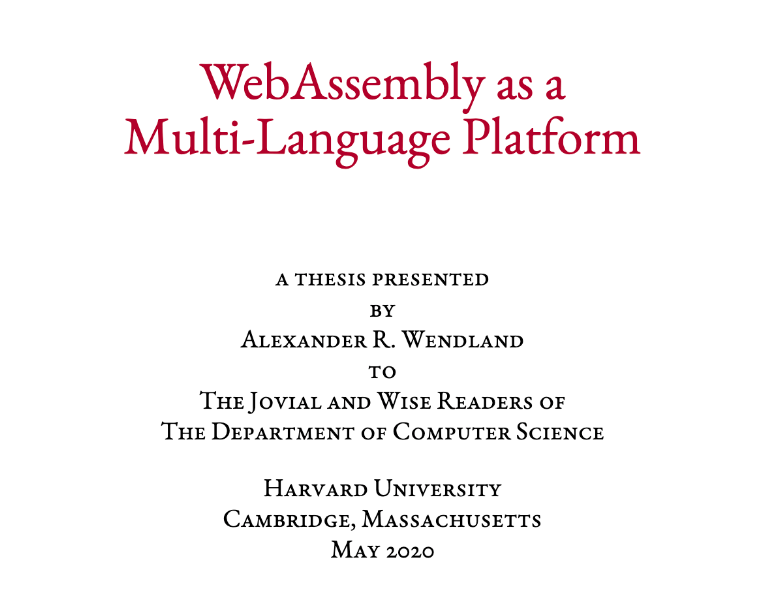

  
   

This repository is for my ([Alex Wendland](https://blog.alexwendland.com/)) undergraduate thesis for Honors in Computer Science at Harvard submitted on April 10th, 2020. My advisor was Professor [Nada Amin](https://lampwww.epfl.ch/~amin/cv/), and my readers were [James Mickens](https://mickens.seas.harvard.edu/), [Stephen Chong](https://people.seas.harvard.edu/~chong/), and [Eddie Kohler](http://www.read.seas.harvard.edu/~kohler/).

If you're looking for an extension of WebAssembly with support for _abstract types_, see [awendland/webassembly-spec-abstypes](https://github.com/awendland/webassembly-spec-abstypes).

## Project History

This project was mostly new territory for me, because it was focused on programming languages (eg. interpreter implementation, formal semantics, secure compilation, full abstraction) which I hadn't directly taken a course in yet. It was a fun challenge and I really appreciated the support of my mentors and peers.

Originally motivated by the goal of treating "languages and libraries orthgonally" (ie. being able to pick a language regardless of the libraries written for it, since you could use any library with any language), I began looking into _secure compilation_ which is the ability to maintain the integrity of _source-level abstractions_ from _target-level attackers_ (I try to explain this more at the end of _Chapter 1_ of my thesis, and I also found [Patrignani et al.'s 2019 survey paper quite approachable](https://scholar.google.com/scholar?oi=bibs&hl=en&cluster=17491953276416494886)). These guarantees of integrity are also important when interoperating multiple languages, since you don't want a Rust program to call into a C function and have the C function violate the ownership guarantees of any Rust values you pass to it. During this, I discovered the importance of target language's feature set in maintaining these source-leve abstractions; without the right feature set it isn't possible to maintain. For example, you're unable to maintain _unforgeable object references_ in x86 Assembly (see the Patrignani paper or, hopefully it's intelligble, Chapter 1 of my thesis if that previous sentence didn't make sense).

This lead me to look at WebAssembly as a target language for modular secure compilation, hence my thesis title, **WebAssembly as a Multi-Language Platform**. I argue for the introduction of _abstract types_ into the core WebAssembly specification in order to support source-level abstractions like object references, unforgeable handles, and referential invariants. Combined with WebAssembly's already powerful featureset—like typed function calls and constrained control flow—WebAssembly makes a compelling candidate for use as a secure multi-language platform.

## Repo Structure

This repo contains several exploratory and supporting pieces of work, with the bulk of the WebAssembly abstract type extension being implemented in another repo ([awendland/webassembly-spec-abstypes](https://github.com/awendland/webassembly-spec-abstypes)).

- `paper/`
  - `thesis-harvard-2020.pdf` - PDF of the thesis which I submitted on April 10th to the CS Department of SEAS.
  - `thesis-harvard-2020-overleaf.zip` - The latex source exported from Overleaf after final submission of my thesis to the department. This document was based on the wonderful [Dissertate](https://github.com/suchow/Dissertate) template by [Jordan Suchow](https://suchow.io/).
- `exploration/` - mini-projects where I messed around with WebAssembly and different {Rust,Zig,C++}-to-WebAssembly compilers. See [exploration/README.md] for more information.
- `samples/` - Runnable examples used in the thesis, primarily _Chapter 3: Maintaining the Integrity of Source Level Abstractions_.
  - `sample-X.Y.wat` would refer to a sample in Chapter X Section Y.
  - `sample-X.Y-abstypes.wat` indicates that the code requires a WebAssembly interpreter with support for the abstract types defined in this thesis. See [Reference implementation](#reference-implementation).
  - `samples.ipynb` - Jupyter notebook populated with the `*.wat` samples; runnable in environments with the [wasm-spec-kernel](https://github.com/awendland/wasm_spec_kernel).

## Reference Implementation

I added support for abstract types (similar to [OCaml's abstract types](https://ocaml.org/learn/tutorials/modules.html#Abstract-types)) to the [reference interpreter](https://github.com/WebAssembly/spec/tree/master/interpreter) for WebAssembly. My extended interpreter can be found at [awendland/webassembly-spec-abstypes](https://github.com/awendland/webassembly-spec-abstypes). Discussion about this feature can be found in _Chapter 2: Extending WebAssembly with Abstract Types_ in the thesis.

To make trying out this implementation easier, I've implemented a generic Jupyter kernel for WebAssembly reference interpreters. It's available on PyPI as [wasm-spec-kernel](https://pypi.org/project/wasm-spec-kernel/) and on [GitHub](https://github.com/awendland/wasm_spec_kernel).

## Samples

I've configured this repository to be runnable via [Binder](https://mybinder.org), so that you can jump right into a web-based Jupyter notebook with the `webassembly-spec-abstypes` interpreter already available and the code in `samples/` all runnable. Try it out with:

